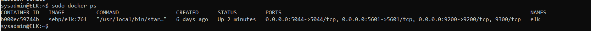

## Automated ELK Stack Deployment

The files in this repository were used to configure the network depicted below.

These files have been tested and used to generate a live ELK deployment on Azure. They can be used to either recreate the entire deployment pictured above. Alternatively, select portions of the ansible_config_playbook.yml file may be used to install only certain pieces of it, such as Filebeat.

  - _TODO: Enter the playbook file._

This document contains the following details:
- Description of the Topology
- Access Policies
- ELK Configuration
  - Beats in Use
  - Machines Being Monitored
- How to Use the Ansible Build

### Description of the Topology

The main purpose of this network is to expose a load-balanced and monitored instance of DVWA, the D*mn Vulnerable Web Application (DVWA).

Load balancing ensures that the application will be highly available, in addition to restricting access to the network and protecting the availability of a resource, in this case, the DVWA. Additionally, a jump box is utillised in order to take further security measures, providing a hardened and more secure method for connecting to the network

Integrating an ELK server allows users to easily monitor the vulnerable VMs for changes to the files and system resources.

The configuration details of each machine may be found below.

| Name     | Function              | IP Address | Operating System |
|----------|-----------------------|------------|------------------|
| Jump Box | Gateway               | 10.1.0.4   | Linux            |
| Web-1    | DVWA container host 1 | 10.1.0.7   | Linux            |
| Web-2    | DVWA container host 2 | 10.1.0.8   | Linux            |
| ELK      | ELK stack server      | 10.0.0.4   | Linux            |

### Access Policies

The machines on the internal network are not exposed to the public Internet. 

Only the jump box machine can accept connections from the Internet. Access to this machine is only allowed from the following IP addresses:
- 111.220.24.35
Machines within the network can only be accessed by other machines within the same or peered virtual networks.

A summary of the access policies in place can be found in the table below.

| Name     | Publicly Accessible | Allow IP Address |
|----------|---------------------|------------------|
| Jump Box | Yes                 | 111.220.24.35    |
| Web-1    | No                  | Virtual Network  |
| Web-2    | No                  | Virtual Network  |
| ELK      | No                  | Virtual Network  |

### Elk Configuration

Ansible was used to automate configuration of the ELK machine. No configuration was performed manually, which is advantageous because configuring a multitude of machines can be tedious and time consuming.
The playbook implements the following tasks:
- Installs onto each machine:
..- docker.io
..- python3-pip
..- docker
..- Allows for more memory use
- Downloads and launches the docker container
- Enables docker service on boot

The following screenshot displays the result of running `docker ps` after successfully configuring the ELK instance.

### Target Machines & Beats
This ELK server is configured to monitor the following machines:
- 10.1.0.7
- 10.1.0.8

We have installed the following Beat on these machines:
- FileBeat

This Beat allow us to collect the following information from each machine:
- Filebeat moniters logfiles or specifically specified locations, providing data regarding files, who accesses/modifies them and what changes where made to the files.

### Using the Playbook
In order to use the playbook, you will need to have an Ansible control node already configured. Assuming you have such a control node provisioned: 

SSH into the control node and follow the steps below:
- Copy the install-elk.yml file to /etc/ansible.
- In order to ensure the playbook installs ELK on the correct machine Update the hosts file to include:

[elk]   
[your.VM.IP] ansible_python_interpreter=/usr/bin/python3.

- Run the playbook (with the command: ansible-playbook install-elk.yml), and navigate to http://[your.VM.IP]:5601/app/kibana to check that the installation worked as expected.
